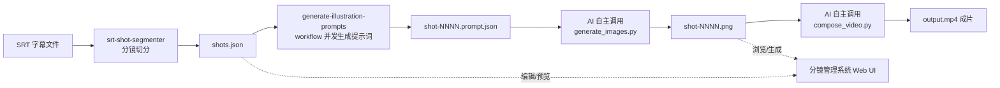
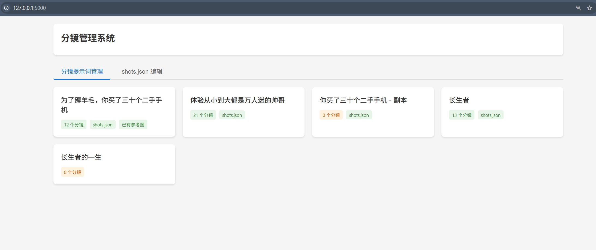
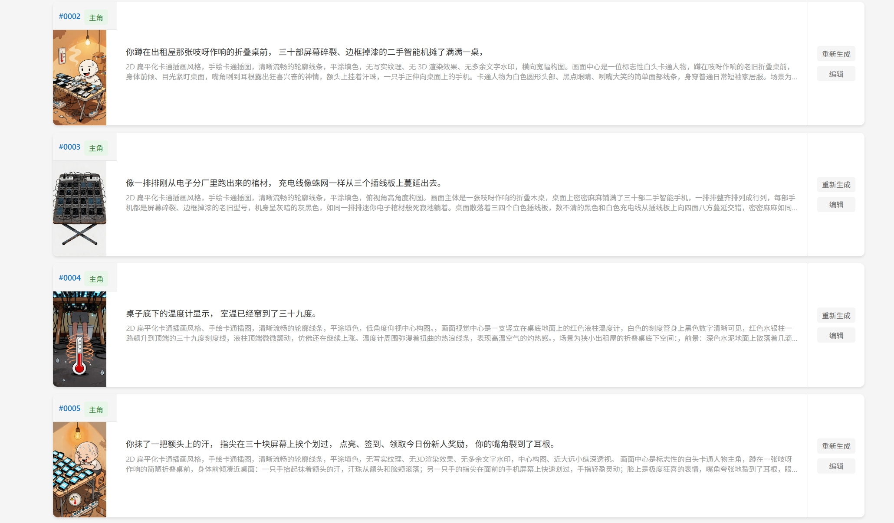

# auto-video-agent

把一段 SRT 字幕文案，自动流水线化生成成套「分镜插画提示词 → AI 生图 → 拼接成片」的视频，基于 Agent / Skill / Workflow 编排。

## 兼用进度

项目内的 Agent/Skill/Workflow 目前按 Claude Code 的约定格式编写。以下是在不同 Coding Harness 下的兼用情况：

| Coding Harness | 状态 |
| --- | --- |
| Claude Code | ✅ 已验证可用 |
| DeepSeek Harness | ⬜ 未测试 |
| Codex | ⬜ 未测试 |
| Gemini CLI | ⬜ 未测试 |

理论上其他支持类似 Agent/Skill/Workflow 编排能力的 Harness 也可以直接复用或少量适配后使用，欢迎反馈实际兼用结果。

## 效果预览

https://github.com/user-attachments/assets/f6d6576f-8c11-4dfe-b1ec-59370cc17bea

https://github.com/user-attachments/assets/88b1fbad-e34c-461d-b6bd-26dd3a6c8073


## 这是什么

给定一份 SRT 字幕文件，本项目会：

1. **自动分镜**：将整份字幕按语义切分成若干「镜头」（2-6 秒/镜），每个镜头带起止时间和台词文本
2. **生成插画提示词**：为每个镜头生成结构化的插画生成提示词（风格、主角、画面描述等），并自动做十项自检
3. **调用文生图 API**：接入火山方舟 Seedream 文生图/图生图接口，把提示词批量转成分镜插画
4. **拼接成片**：按分镜时间轴把所有插画拼接成一段无声视频
5. **可视化管理**：提供一个本地 Web 管理界面，浏览分镜库、预览/生成图片、编辑分镜数据

整条链路（含生图、拼接成片）都可以由 AI 自主调度完成：只需在 Claude Code 里给出 SRT 路径和画风要求，Claude 会自主派发 Agent（`.claude/agents/`）+ 运行 Workflow（`.claude/workflows/`）完成分镜切分与提示词生成，再自主通过 Bash 调用 `scripts/generate_images.py`、`scripts/compose_video.py` 完成生图和拼接，不需要人工逐步执行脚本。手动执行脚本仅作为备选方式（用于单独重跑某一步或不想经由 AI 调度的场景）。AI 生成的正文内容全部由子智能体自己落盘，主会话只传递状态和路径，避免上下文被大量正文占满。

## 工作流程



> 图中从切分到成片的每一步，正常情况下都由 AI 在对话中自主完成，无需手动运行脚本；手动执行脚本仅作为备选方式。

## 目录结构

```
.
├── .claude/
│   ├── agents/         # srt-shot-segmenter（分镜切分）、prompt-generator（提示词生成）、prompt-result-verifier（批量校验）
│   ├── skills/         # 分镜切分、插画提示词生成等技能定义
│   └── workflows/       # generate-illustration-prompts.js：并发生成 + 批量校验的编排脚本
├── plugins/
│   ├── seedream-image-gen/          # 火山方舟 Seedream 文生图插件（MCP 常驻进程版）
│   └── seedream-image-gen-simple/   # 轻量版，直接 Bash 调脚本，无常驻进程
├── scripts/
│   ├── generate_images.py   # 批量生成分镜图片
│   ├── compose_video.py     # 按 shots.json 时间轴拼接图片为视频
│   └── verify_shots.py      # 批量校验分镜提示词结果文件
├── web/                 # 分镜管理系统（Flask + 原生前端）
├── 文案分镜库/            # 示例文案及对应分镜产出
├── 示例/                 # 效果预览视频与截图
└── 使用指南.md            # 详细使用文档（中文）
```

## 快速开始

### 1. 环境准备

```bash
python -m venv .venv
.venv\Scripts\activate
pip install -r web/requirements.txt
```

在项目根目录创建 `.env`（参考 `.env.example`）：

```
ARK_API_KEY=你的火山方舟 API Key
```

> API Key 获取地址：https://console.volcengine.com/ark/region:cn-beijing/apikey

### 2. 让 AI 自主完成分镜切分 → 提示词生成 → 生图 → 拼接成片

正常用法是在 Claude Code 对话里直接说明需求，例如：

```
我想把 SRT 文件转换成视频。
SRT 路径：文案分镜库/你的项目目录/文案.srt
画风：扁平、手绘卡通插图
主角：标志性的白头卡通人物
```

Claude 会自主完成整条链路：派发 `srt-shot-segmenter` agent 切分出 `shots.json`，运行 `generate-illustration-prompts` workflow 并发生成插画提示词（`prompt-generator` 生成 + `prompt-result-verifier` 批量校验），再通过 Bash 自主调用 `scripts/generate_images.py` 批量生图、`scripts/compose_video.py` 拼接成片，全程不需要人工逐步执行脚本。具体的 agent/workflow 调度细节见 [使用指南.md](使用指南.md)。

### 3. 手动执行脚本（备选）

如果不想经由 AI 调度，或者需要单独重跑某一步，也可以手动执行对应脚本：

分镜切分 + 生成插画提示词的手动流程见 [使用指南.md](使用指南.md)；`shots.json` 和分镜提示词就位后，可手动生成分镜图片：

```bash
python scripts/generate_images.py --dir "文案分镜库/你的项目目录"
```

再拼接成片（需要本机安装 `ffmpeg` 并加入 PATH）：

```bash
python scripts/compose_video.py --dir "文案分镜库/你的项目目录"
```

`<项目目录>` 下需要有 `shots.json`（分镜时间数据）和 `images/`（对应分镜插画，文件名如 `shot-0001.png`）。输出默认为 `<项目目录>/output.mp4`。

### 4. 启动分镜管理系统（可选）

```bash
cd web
pip install -r requirements.txt
python app.py
```

访问 http://localhost:5000，可以浏览分镜库、预览/一键生成分镜图片、编辑分镜提示词与 `shots.json`。

<p align="center">
  
  
</p>

## 技术栈

- Claude Code Agent / Skill / Workflow（分镜切分、提示词生成、批量校验的核心编排，兼用进度见上文）
- Python（Flask 后端、图像生成与视频拼接脚本）
- 火山方舟 Seedream 文生图/图生图 API
- ffmpeg（视频拼接）

## 当前限制

- 拼接视频目前只支持无声输出，配音需另行用 ffmpeg 叠加音轨
- 暂不支持转场特效（当前为硬切）

## License

暂未指定 License。
